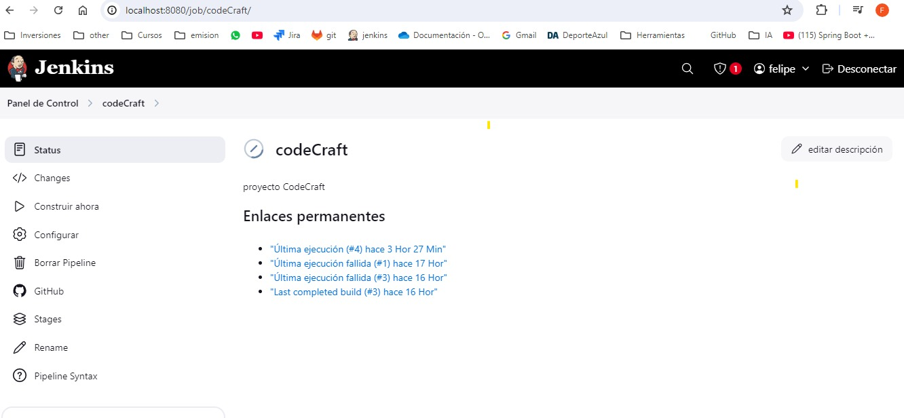

# Informe de ejecución del pipeline Proyecto CodeCraft

## Resumen

Este informe describe los pasos tomados para configurar y ejecutar la canalización CI/CD
para el proyecto de API de tareas.

## Pasos

1. **Creación del Repositorio**

    - Se inicializa el repositorio en GitHub. y se suben los archivos del proyecto.
    - https://github.com/FelipeCarillancaDev/CodeCraft

2. **Integración con Docker**

    - Se creó un Dockerfile para contener la aplicación.

3. **Configuración de Jenkins**

    - Se configura Jenkins para automatizar el proceso de compilación, prueba e implementación.
   - 
   
## Errores encontrador
- Se encontro un error al ejecutar el pipeline en Jenkins. Debido a estar usando S.O Windows. hay que configurar el archivo
  Jenkinsfile usando bat en lugar de sh.
- 

## Resultados
   
- Resultados de la ejecución del pipeline
   - 
   - 
  
---
- Se adjunta Logs de ejecución
```
Lanzada por el usuario felipe
Obtained Jenkinsfile from git https://github.com/FelipeCarillancaDev/CodeCraft.git
[Pipeline] Start of Pipeline
[Pipeline] node
Running on Jenkins  in C:\ProgramData\Jenkins\.jenkins\workspace\codeCraft
[Pipeline] {
    [Pipeline] stage
    [Pipeline] { (Declarative: Checkout SCM)
        [Pipeline] checkout
        Selected Git installation does not exist. Using Default
        The recommended git tool is: NONE
        No credentials specified
                > git.exe rev-parse --resolve-git-dir C:\ProgramData\Jenkins\.jenkins\workspace\codeCraft\.git # timeout=10
        Fetching changes from the remote Git repository
        > git.exe config remote.origin.url https://github.com/FelipeCarillancaDev/CodeCraft.git # timeout=10
                Fetching upstream changes from https://github.com/FelipeCarillancaDev/CodeCraft.git
        > git.exe --version # timeout=10
                > git --version # 'git version 2.45.1.windows.1'
                > git.exe fetch --tags --force --progress -- https://github.com/FelipeCarillancaDev/CodeCraft.git +refs/heads/*:refs/remotes/origin/* # timeout=10
        > git.exe rev-parse "refs/remotes/origin/main^{commit}" # timeout=10
        Checking out Revision 04704c6e1e2b2b99339fc132bffab862b80bcb4d (refs/remotes/origin/main)
        > git.exe config core.sparsecheckout # timeout=10
                > git.exe checkout -f 04704c6e1e2b2b99339fc132bffab862b80bcb4d # timeout=10
        Commit message: "se modifica pruebas de est y archivo jenkins"
                > git.exe rev-list --no-walk 04704c6e1e2b2b99339fc132bffab862b80bcb4d # timeout=10
        [Pipeline] }
    [Pipeline] // stage
    [Pipeline] withEnv
    [Pipeline] {
        [Pipeline] stage
        [Pipeline] { (Clonar Repositorio)
            [Pipeline] git
            Selected Git installation does not exist. Using Default
            The recommended git tool is: NONE
            No credentials specified
                    > git.exe rev-parse --resolve-git-dir C:\ProgramData\Jenkins\.jenkins\workspace\codeCraft\.git # timeout=10
            Fetching changes from the remote Git repository
            > git.exe config remote.origin.url https://github.com/FelipeCarillancaDev/CodeCraft.git # timeout=10
                    Fetching upstream changes from https://github.com/FelipeCarillancaDev/CodeCraft.git
            > git.exe --version # timeout=10
                    > git --version # 'git version 2.45.1.windows.1'
                    > git.exe fetch --tags --force --progress -- https://github.com/FelipeCarillancaDev/CodeCraft.git +refs/heads/*:refs/remotes/origin/* # timeout=10
            > git.exe rev-parse "refs/remotes/origin/main^{commit}" # timeout=10
            Checking out Revision 04704c6e1e2b2b99339fc132bffab862b80bcb4d (refs/remotes/origin/main)
            > git.exe config core.sparsecheckout # timeout=10
                    > git.exe checkout -f 04704c6e1e2b2b99339fc132bffab862b80bcb4d # timeout=10
                    > git.exe branch -a -v --no-abbrev # timeout=10
                    > git.exe branch -D main # timeout=10
                    > git.exe checkout -b main 04704c6e1e2b2b99339fc132bffab862b80bcb4d # timeout=10
            Commit message: "se modifica pruebas de est y archivo jenkins"
            [Pipeline] }
        [Pipeline] // stage
        [Pipeline] stage
        [Pipeline] { (Instalar Dependencias)
            [Pipeline] bat

            C:\ProgramData\Jenkins\.jenkins\workspace\codeCraft>npm install

            up to date, audited 355 packages in 3s

            48 packages are looking for funding
            run `npm fund` for details

            found 0 vulnerabilities
            [Pipeline] }
        [Pipeline] // stage
        [Pipeline] stage
        [Pipeline] { (Ejecutar Pruebas)
            [Pipeline] bat

            C:\ProgramData\Jenkins\.jenkins\workspace\codeCraft>npm test

                    > task-api@1.0.0 test
            > jest

            console.log
            API is running on port 3000

            at Server.log (app.js:22:32)

            PASS test/app.test.js
            Tasks API
            √ should return all tasks (79 ms)
            √ should return a task by ID (5 ms)
            √ should return 404 if task is not found (8 ms)

            Test Suites: 1 passed, 1 total
            Tests:       3 passed, 3 total
            Snapshots:   0 total
            Time:        1.635 s, estimated 11 s
            Ran all test suites.
                    Jest did not exit one second after the test run has completed.

            'This usually means that there are asynchronous operations that weren't stopped in your tests. Consider running Jest with `--detectOpenHandles` to troubleshoot this issue.


```